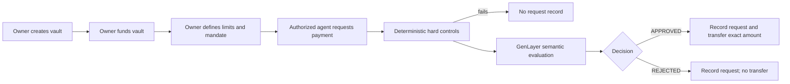
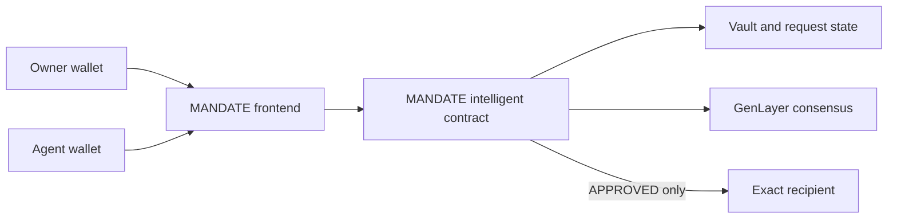

# MANDATE

**Give your agent a budget. Not your wallet.**

MANDATE is a policy-controlled GEN vault for autonomous agents. An owner creates and funds a vault, authorizes one agent address, sets deterministic spending limits, and writes a natural-language mandate. The agent can propose exact payments, but the contract applies hard controls first and then uses GenLayer semantic evaluation to determine whether the declared expenditure complies with the mandate.

When an eligible request is approved, MANDATE records the request and transfers the requested GEN amount to the specified recipient. A semantically rejected request is recorded without spending vault funds. Requests that fail deterministic checks stop before a request record is created.

## Vision

Autonomous agents may need permission to spend, but unrestricted wallet custody makes useful boundaries difficult to enforce. MANDATE separates the ability to propose a payment from the authority to move treasury funds: the agent submits a contract-defined request, while the vault owner’s limits and mandate remain in force.

## Key Innovations

- **Non-custodial agent authority:** the authorized agent can request payments but has no generic vault withdrawal method.
- **Deterministic spending controls:** transaction limits, balance checks, period budgets, authorization, vault status, and recipient restrictions are enforced by contract code.
- **Natural-language mandates:** GenLayer evaluates the declared expenditure against the owner’s written policy after hard controls pass.
- **Exact payment execution:** an approved request is tied to one recipient and one amount.
- **Versioned policy:** mandate and limit updates increment the mandate version and reset the configured period accounting.
- **Compact request auditability:** finalized requests retain the mandate version and policy digest used for evaluation, without copying the full mandate into each request.

## How MANDATE Works



Hard controls are handled by the contract. GenLayer only evaluates whether the declared request complies with the owner’s mandate; it does not decide the vault’s balance, authorization, limits, or transfer mechanics.

## Vault & Request Lifecycle

### Vault lifecycle

`create_vault` creates a vault owned by the transaction sender, assigns one authorized agent, stores the initial mandate as version `1`, and starts the vault in `ACTIVE` status. The owner may then:

- fund the vault with native GEN;
- pause or resume the vault;
- replace the authorized agent;
- update the mandate, transaction limit, period budget, and period duration; and
- withdraw available vault balance.

Deposits and withdrawals are owner-only. Updating a mandate increments `mandate_version`, creates a new policy digest, and resets `period_start` to the update time with `period_spent` set to zero.

### Request lifecycle

The authorized agent calls `request_spend` with a vault ID, recipient, amount, category, and purpose. The contract checks authorization, vault status, amount, balance, recipient validity, self-payment prevention, text bounds, and period budget before invoking semantic evaluation.

If semantic evaluation returns `REJECTED`, the contract records the request with its decision, version, digest, and timestamps. It does not reduce the vault balance, increase period spending, or transfer GEN.

If semantic evaluation returns `APPROVED`, the contract updates vault accounting, records the request, and invokes the native GEN transfer to the exact recipient for the exact requested amount.

Deterministic failures raise a contract error before semantic evaluation and before `_record_request` is called. They are not stored as `BLOCKED` request records.

## Spending Controls

Before semantic evaluation, the contract enforces:

- the caller is the vault’s current authorized agent;
- the vault is `ACTIVE`;
- the amount is nonzero and does not exceed `max_transaction_amount`;
- the vault has enough internal balance;
- the recipient is a valid, nonzero address;
- the recipient is not the authorized agent;
- category and purpose satisfy the required text bounds; and
- the request fits within the current period budget.

All persistent collections use bounded counters and `TreeMap` indexes. Pagination is capped at 50 items per call, with caps of 1,000 vaults, 100,000 requests, and 10,000 requests per vault.

### Period budget

Each vault stores `period_budget`, `period_seconds`, `period_start`, and `period_spent`. The contract uses fixed periods based on the stored start timestamp. When a spending request is evaluated after the configured period has elapsed, the working period starts at the current transaction time and working spending resets to zero. An approved request then adds its amount to that period’s spending.

For example, a vault configured with a 10 GEN transaction limit and a 20 GEN budget over 7 days cannot approve one payment above 10 GEN, and cannot approve payments that would take the current period above 20 GEN.

Rejected semantic requests do not spend the period budget. Updating the mandate explicitly starts a new period and clears the stored period spending.

## GenLayer Policy Evaluation

The contract passes an immutable proposal snapshot containing:

- the current mandate;
- mandate version;
- category;
- purpose;
- amount; and
- recipient.

The prompt separates mandate policy from meta-instructions. Substantive permissions, prohibitions, and conditions in the mandate are binding policy. Text in the mandate, category, purpose, or recipient fields that attempts to override evaluator behavior is treated as untrusted data and ignored as a meta-instruction.

The semantic evaluator must return exactly one JSON object with exactly one key, `decision`, whose value is `APPROVED` or `REJECTED`. Ambiguous, unrelated, prohibited, malformed, or insufficiently supported requests fail closed to `REJECTED`. Free-form explanations and scores are not part of the consensus result.

The implementation uses `gl.nondet.exec_prompt` for the semantic proposal and `gl.vm.run_nondet` so validators independently evaluate the same snapshot and compare the normalized result. Deterministic limits, balances, authorization, and transfers remain outside the model’s authority.

## Roles

| Role                | Responsibility                                                                                                                      |
| ------------------- | ----------------------------------------------------------------------------------------------------------------------------------- |
| Owner               | Creates the vault, funds it, defines its mandate and limits, manages its agent, pauses/resumes it, and withdraws available balance. |
| Authorized agent    | Proposes exact payment requests for its vault. It cannot use the owner-only withdrawal path.                                        |
| Recipient           | Receives native GEN only when an approved request executes successfully.                                                            |
| GenLayer validators | Independently evaluate the semantic proposal through the contract’s nondeterministic consensus flow.                                |
| MANDATE contract    | Stores vault and request state, enforces deterministic controls, records decisions, and invokes permitted native GEN transfers.     |

## Architecture



The frontend prepares reads and writes, while the deployed intelligent contract remains authoritative for permissions, balances, policy versions, decisions, and transfers.

## Live Product Experience

The current frontend provides:

- injected wallet connection and Studio Next network switching;
- live owner dashboard and protocol counts;
- vault creation and live vault detail pages;
- owner actions for funding, pausing, resuming, agent replacement, mandate updates, and withdrawals;
- an authorized-agent request flow;
- live request detail pages;
- Transaction Kit fee review and hold-to-confirm signing; and
- transaction status and explorer links.

These are interface capabilities. The frontend does not define vault or request state.

## Trust Model

### Contract authority

The deployed MANDATE contract is authoritative for vault ownership, authorized agents, balances, status, spending controls, mandate versions, request records, semantic decisions, and native GEN transfers.

### Frontend responsibility

The frontend reads contract state and prepares user-confirmed transactions. It is not a substitute for contract authorization and does not fabricate finalized vault balances or request decisions.

### Agent authority

The agent submits `request_spend`. It does not receive generic custody or a generic withdrawal function. Owner-only methods remain restricted to the vault owner by the contract.

### Semantic evaluation boundary

GenLayer evaluates the declared payment request against the owner’s mandate. MANDATE does not prove how a recipient uses funds after a successful transfer.

## Contract Interface

### Writes

| Method                                                                                                      | Purpose                                                                           |
| ----------------------------------------------------------------------------------------------------------- | --------------------------------------------------------------------------------- |
| `create_vault(name, agent_address, mandate, max_transaction_amount, period_budget, period_seconds) -> u256` | Creates an owned `ACTIVE` vault and returns its ID.                               |
| `deposit(vault_id) -> None` **payable**                                                                     | Adds the transaction’s native GEN value to an owner’s vault.                      |
| `request_spend(vault_id, recipient_address, amount, category, purpose) -> u256`                             | Evaluates and records an agent payment request, transferring only for `APPROVED`. |
| `pause_vault(vault_id) -> None`                                                                             | Pauses agent spending requests for the vault.                                     |
| `resume_vault(vault_id) -> None`                                                                            | Resumes a paused vault.                                                           |
| `replace_agent(vault_id, new_agent_address) -> None`                                                        | Replaces the vault’s authorized agent.                                            |
| `update_mandate(vault_id, mandate, max_transaction_amount, period_budget, period_seconds) -> None`          | Creates the next mandate version and resets period accounting.                    |
| `withdraw(vault_id, amount) -> None`                                                                        | Transfers available native GEN from a vault to its owner.                         |

### Views

| Method                                                   | Purpose                                                                            |
| -------------------------------------------------------- | ---------------------------------------------------------------------------------- |
| `get_config() -> dict`                                   | Returns protocol precision, caps, text limits, decisions, and accounting metadata. |
| `get_vault_count() -> u256`                              | Returns the total number of vaults.                                                |
| `get_request_count() -> u256`                            | Returns the total number of stored semantic requests.                              |
| `get_vault(vault_id) -> dict`                            | Returns one vault’s state and policy digest.                                       |
| `get_request(request_id) -> dict`                        | Returns one stored request record.                                                 |
| `get_vaults(offset, limit) -> dict`                      | Returns a bounded page of all vaults.                                              |
| `get_vault_requests(vault_id, offset, limit) -> dict`    | Returns a bounded page of one vault’s requests.                                    |
| `get_owner_vaults(owner_address, offset, limit) -> dict` | Returns a bounded page of vaults owned by an address.                              |

## Configuration & Limits

The contract uses native GEN with 18 decimal places; persistent monetary values are represented in atto-GEN. The public configuration exposes these principal limits:

| Configuration              |                            Value |
| -------------------------- | -------------------------------: |
| Maximum page size          |                               50 |
| Maximum vaults             |                            1,000 |
| Maximum requests           |                          100,000 |
| Maximum requests per vault |                           10,000 |
| Period duration            | 60 seconds to 31,536,000 seconds |
| Maximum vault balance      |                 `10^30` atto-GEN |
| Maximum configured amount  |                 `10^30` atto-GEN |
| Vault name                 |                   80 UTF-8 bytes |
| Category                   |                   80 UTF-8 bytes |
| Mandate                    |                4,000 UTF-8 bytes |
| Purpose                    |                2,000 UTF-8 bytes |

The contract rejects empty required text, control characters, zero addresses, invalid page ranges, and arithmetic overflow.

## Transaction UX

The frontend uses an injected EIP-1193 wallet and asks the wallet to switch to or add GenLayer Studio Next when necessary. Public reads use a wallet-independent GenLayer client.

Writes use the pinned Transaction Kit integration. The user reviews the live fee quote, performs the kit’s hold-to-confirm signing gesture, receives transaction status updates, and gets an explorer link. The frontend verifies the execution result rather than treating submission or acceptance alone as success, then refetches affected contract state.

## Tech Stack

- GenLayer intelligent contract in Python using the pinned GenVM runner.
- React 19, TanStack Start, TanStack Router, and TanStack Query.
- Vite and Bun.
- `genlayer-js@2.0.0-rc.1`.
- `@genlayer/transaction-kit@0.1.0-rc.2`.
- `@genlayer/transaction-kit-react@0.1.0-rc.2`.
- `viem@2.56.5` for address and wallet-facing types/utilities.

## Repository Structure

```text
mandate/
├── contracts/
│   └── Mandate.py
├── frontend/
│   ├── src/
│   └── package.json
└── README.md
```

## Local Development

```bash
cd frontend
bun install
bun run dev
```

Useful frontend checks:

```bash
bunx tsc --noEmit
bun run lint
bun run test
bun run build
```

The frontend is configured for the deployed Studio Next contract below. Ordinary local development does not require redeploying the contract.

## Deployment

| Resource        | Value                                                              |
| --------------- | ------------------------------------------------------------------ |
| Network         | GenLayer Studio Next                                               |
| Chain ID        | `61997`                                                            |
| Contract        | `0x85824bc12E7CA306A4671C9A5a102aEBacC7E109`                       |
| RPC             | <https://studio-next.genlayer.com/api>                             |
| Explorer        | <https://explorer-studio-dev.genlayer.com/>                        |
| Contract runner | `py-genlayer:5jycge4q8k23462jtb0b9fyey1s9qz928sz2nbrd9mg4sxqg2qng` |

## Limitations / Current Scope

MANDATE V1 intentionally supports:

- native GEN only;
- one owner and one authorized agent per vault;
- owner-controlled deposits, policy updates, agent replacement, pausing, resuming, and withdrawals;
- fixed-period budgets rather than a rolling-window budget;
- declared-purpose semantic evaluation, not post-payment evidence or real-world usage verification;
- bounded vault and request storage with paginated reads; and
- direct exact-recipient native GEN transfers for approved requests.

It does not implement ERC-20 support, arbitrary calldata or external contract execution, multi-agent vaults, multisig governance, subscriptions, staking, slashing, reputation, invoices, evidence URLs, or vendor-marketplace features.
